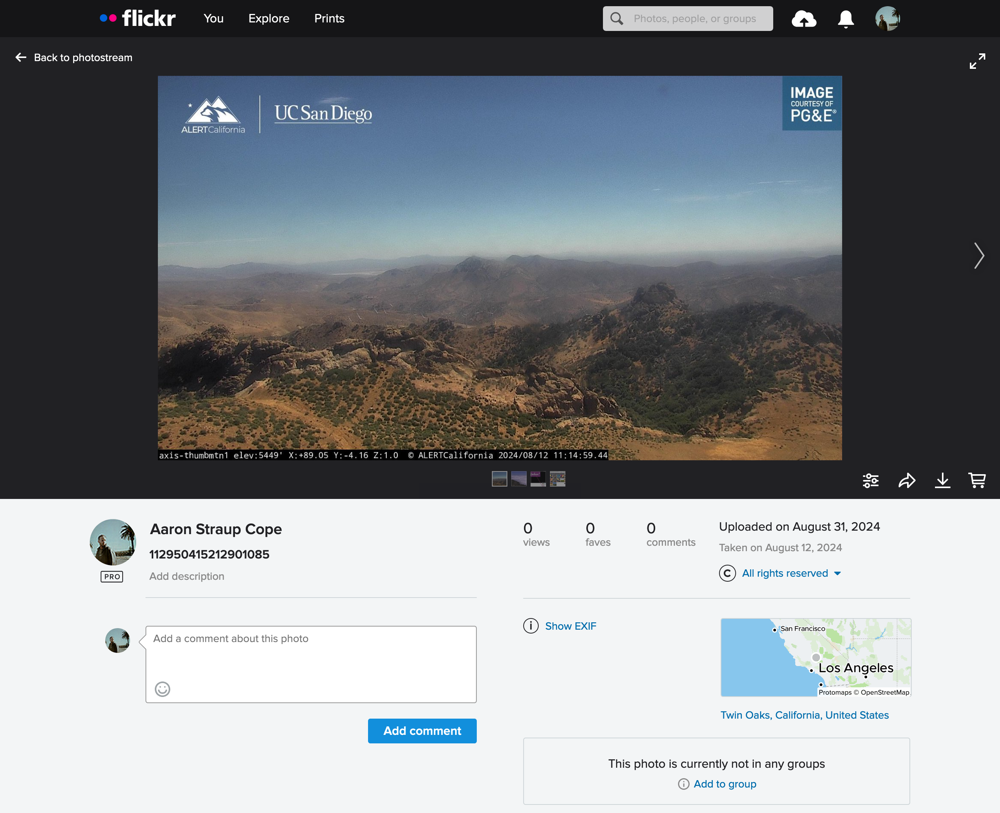

# go-california-landscapes

Go package to parse posts from the [California Landscapes bot](https://botsin.space/users/CALandscapeBot/) and create new JPEG images with embedded EXIF data derived from those posts.

## Motivation

I love the [California Landscapes bot](https://botsin.space/users/CALandscapeBot/) and I wanted to have an archive of images that I especially liked.

## Tools

```
$> make cli
go build -mod vendor -ldflags="-s -w" -o bin/fetch cmd/fetch/main.go
```

### show

```
$> ./bin/fetch -h
Fetch one or more posts from the California Landscapes bot and create a new JPEG image with EXIF data derived from the post.
Usage:
	 ./bin/fetch [options] url(N) url(N)
Valid options are:
  -destination string
    	The destination folder where images should be written. Default is the current working directory. (default ".")
  -verbose
    	Enable verbose (debug) logging.
```

### For example:

```
$> ./bin/fetch -verbose https://botsin.space/users/CALandscapeBot/statuses/112950415212901085
2024/08/31 12:34:20 DEBUG Verbose logging enabled
2024/08/31 12:34:20 DEBUG Fetch URL url=https://botsin.space/users/CALandscapeBot/statuses/112950415212901085
2024/08/31 12:34:23 DEBUG Unknown or unsupported property url=https://botsin.space/users/CALandscapeBot/statuses/112950415212901085 property=og:site_name
2024/08/31 12:34:23 DEBUG Unknown or unsupported property url=https://botsin.space/users/CALandscapeBot/statuses/112950415212901085 property=og:type
2024/08/31 12:34:23 DEBUG Unknown or unsupported property url=https://botsin.space/users/CALandscapeBot/statuses/112950415212901085 property=og:title
2024/08/31 12:34:23 DEBUG Unknown or unsupported property url=https://botsin.space/users/CALandscapeBot/statuses/112950415212901085 property=profile:username
2024/08/31 12:34:23 DEBUG Parse description string values latitude=35.2743 longitude=-118.2364 altitude=5446
2024/08/31 12:34:23 DEBUG Fetch URL url=https://files.botsin.space/media_attachments/files/112/950/413/693/134/762/original/d8a1f00c51e4acb9.jpeg
2024/08/31 12:34:25 INFO Successfully fetched image url=https://botsin.space/users/CALandscapeBot/statuses/112950415212901085 path=/usr/local/src/go-california-landscapes/112950415212901085.jpg
```

And then:

```
$> exiv2 -pa ./112950415212901085.jpg
Exif.Image.GPSTag                            Long        1  138
Exif.GPSInfo.GPSLatitude                     Rational    3  35 deg 16' 27"
Exif.GPSInfo.GPSLatitudeRef                  Ascii       2  North
Exif.GPSInfo.GPSLongitude                    Rational    3  118 deg 14' 11"
Exif.GPSInfo.GPSLongitudeRef                 Ascii       2  West
Exif.GPSInfo.GPSAltitude                     Rational    1  1659 m
Exif.Image.DateTimeOriginal                  Ascii      20  2024:08:12 18:16:00
Exif.Image.ImageID                           Ascii      56  https://botsin.space/@CALandscapeBot/112950415212901085
Exif.Image.ExifTag                           Long        1  260
Exif.Photo.ImageUniqueID                     Ascii     106  https://files.botsin.space/media_attachments/files/112/950/413/693/134/762/original/d8a1f00c51e4acb9.jpeg
```

Of, if you upload the image to [Flickr](https://flickr.com) and you have both the settings to read EXIF data and automatically geotag your photos enabled you'll see [something like this](https://www.flickr.com/photos/straup/53961394266):



## To do

The following tasks are on my "to do" in no particular order and with no expected timeline. Any help or pull requests are welcome:

* Make it possible to run this as a AWS Lambda function.

* Use the [gocloud.dev/blob](https://gocloud.dev/howto/blob/) abstraction layer to write files to both the local file system and remote storage platforms.

* Add the ability to [post images directly to Flickr](https://github.com/aaronland/go-flickr-api).

* Figure out what value(s) I need to pass to the [dsoprea/go-exif](https://github.com/dsoprea/go-exif) package in order to write `GPSAltitudeRef` tags.

## See also

* https://botsin.space/@CALandscapeBot
* https://github.com/sfomuseum/go-exif-update
* https://github.com/dsoprea/go-exif
* https://github.com/anaskhan96/soup